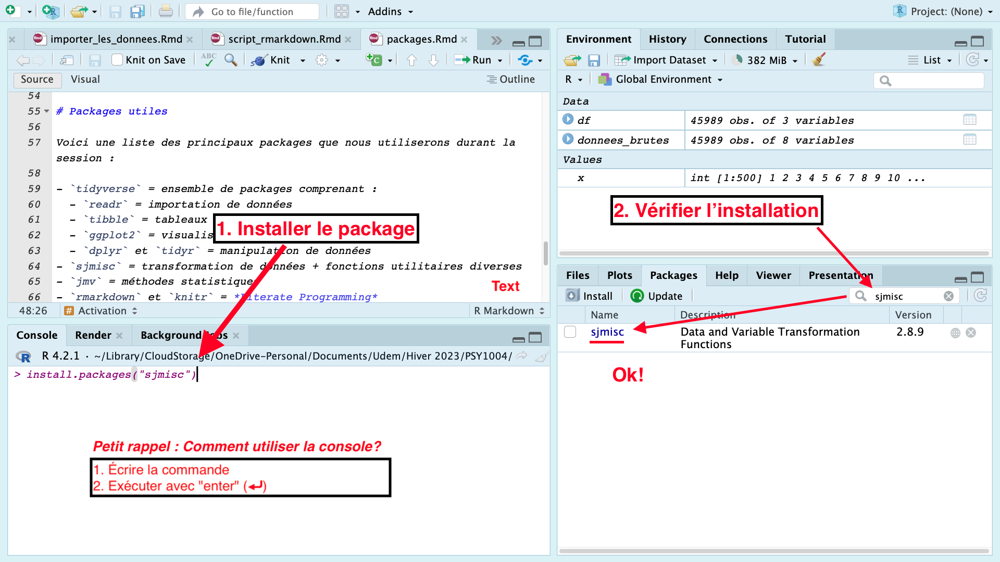
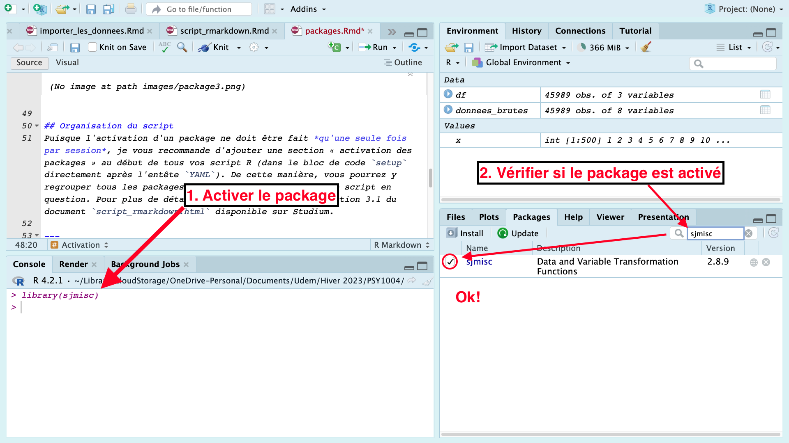
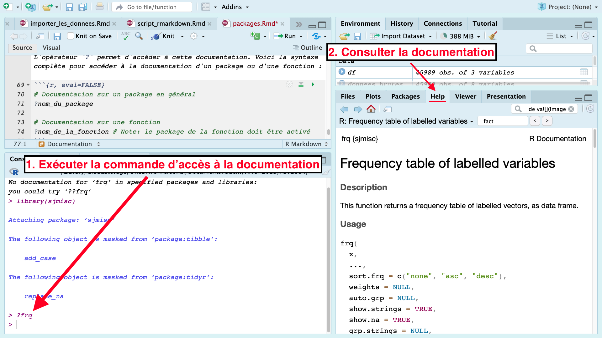

---

***Important :*** Pour faciliter votre compréhension de ce guide, vous devez préalablement vous êtres familiarisé.e avec les bases de la rédaction d'un script RMarkdown. Si ce n'est pas déjà fait, veuillez lire attentivement le guide suivant : [Rédiger un script RMarkdown](../content/script_rmarkdown.html). 

---

Les packages sont des **modules** (ou extensions, librairies, bibliothèques) qui contiennent un ensemble de **fonctions** souvent liées à une méthode ou un domaine particulier.

---

# Installer et activer les packages
Les packages doivent être **installés** une seule fois, mais **activés** à chaque session (aka. chaque fois que vous ouvrez RStudio).

## Installation

Voici la syntaxe pour installer/télécharger un package. 
```{r, eval=FALSE}
install.packages("nom_du_package")
```
*Note: Les guillemets sont nécessaires.*

Si le package s'installe correctement, vous devriez être en mesure de le trouver dans l'onglet `packages` de la fenêtre en bas à droite dans RStudio. Puisque cette commande ne doit être exécutée qu'une seule fois, il est inutile de l'inclure à votre script. Vous pouvez simplement l'exécuter dans la console (l'onglet en bas à gauche dans RStudio).  
  


## Activation
Voici la syntaxe pour activer (charger) un package : 
```{r, eval=FALSE}
library(nom_du_package)
```

Pour savior si un package a été correctement activé dans votre session actuelle, vous pouvez vérifier que celui-ci est coché dans l'onglet `packages` de la fenêtre en bas à droite dans RStudio.  
  

## Organisation du script
Puisque l'activation d'un package ne doit être fait *qu'une seule fois par session*, je vous recommande d'ajouter une section « activation des packages » au début de tous vos script R (dans le bloc de code `setup` directement après l'entête `YAML`). De cette manière, vous pourrez y regrouper tous les packages dont vous avez besoin pour le script en question. Pour plus de détails, veuillez consulter la section 3.1 du document `script_rmarkdown.html` disponible sur Studium.

---

# Packages utiles

Voici une liste des principaux packages que nous utiliserons durant la session : 

- `tidyverse` = ensemble de packages comprenant :   
  - `readr` = importation de données  
  - `tibble` = tableaux de données  
  - `ggplot2` = visualisation de données/graphiques   
  - `dplyr` et `tidyr` = manipulation de données  
- `sjmisc` = transformation de données + fonctions utilitaires diverses  
- `jmv` = méthodes statistiques  
- `psych` = méthode statistiques courantes en psychologie  
- `rmarkdown` et `knitr` = *Literate Programming*

---

# Documentation  
Les packages R et leurs fonctions sont généralement accompagnés de *vignettes* destinées à informer l'utilisateur sur leur fonctionnement. L'opérateur `?` permet d'accéder à cette documentation. Voici la syntaxe complète pour accéder à la documentation d'un package ou d'une fonction : 
```{r, eval=FALSE}
# Documentation sur un package en général
?nom_du_package

# Documentation sur une fonction
?nom_de_la_fonction # Note: le package de la fonction doit être activé
```

  
