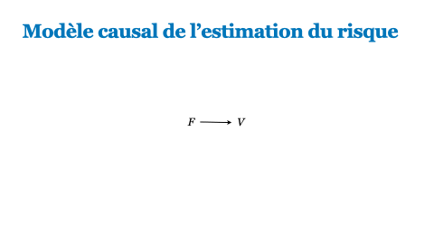

------------------------------------------------------------------------

### PSY1004H - Session d'hiver 2023

**Notes de cours :**

1.  [Rédiger un script RMarkdown](content/script_rmarkdown.html)\
2.  [Installer et activer des packages](content/packages.html)\
3.  [Importer les données](content/importer_les_donnees.html)
4.  [Préparer les données](content/preparer_les_donnees.html)\
5.  [Visualiser les données](content/visualiser_les_donnees.html)\
6.  [Comparer des moyennes](content/comparaison_de_moyennes.html)\
7.  [Corrélation de Pearson et de Spearman](content/Correlation.html)\
8.  [Test-t et test U Mann-Whitney](content/test-t.html)\
9.  [ANOVA et test de Kruskal-Wallis](content/ANOVA.html)\
10. [Chi-carré et méthode exact de Fisher](content/Chi-carré.html)

**Enregistrements des séances :**

-   [Visualiser les données - 8/02/2023](https://youtu.be/qsP62S8dEXo)
-   [Comparaison de moyennes - 15/02/2023](https://youtu.be/vSftGWhzs80)
-   [Corrélation - 8/03/2023](https://youtu.be/L8SoqzQ76h8)
-   [Test-t - 15/03/2023](https://youtu.be/ec7ZzqstF0I)
-   [ANOVA - 22/03/2023](https://youtu.be/iL4VF7JZwq4)
-   [Chi-carré et autres tests non-paramétriques - 29/03/2023](https://youtu.be/gGjpkzmHcQI)

------------------------------------------------------------------------

### Thèse de maîtrise

------------------------------------------------------------------------

### Autre

-   [Application pour étudier la distribution Dirichlet](https://xavierlarochelle.shinyapps.io/dirichlet/)

-   [Application pour étudier les corrélations](https://xavierlarochelle.shinyapps.io/Correlation-app/)
