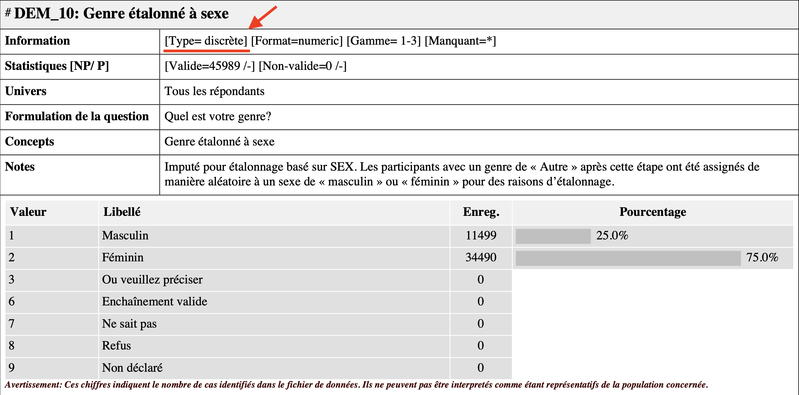
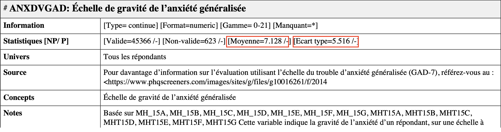
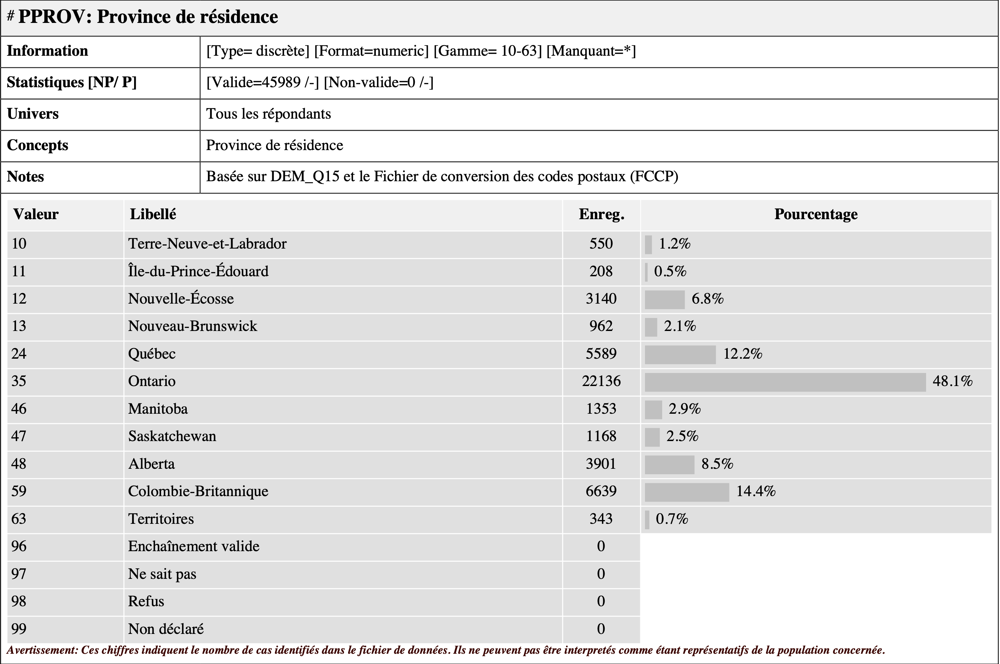

```{css, echo=F}
pre code {
  white-space: pre;
}
```

---

```{r setup, include=FALSE}
# Packages
library(knitr)
library(readr)
library(tibble)
library(jmv)
library(sjmisc)

# Importer les données
donnees_brutes <- read_csv("../data/RCC-5323-F-2020-SM_F1.csv")  
```

***Important :*** Ce guide assume que vous savez comment :  

1. [Rédiger un script RMarkdown](../content/script_rmarkdown.html)  
2. [Installer et activer des packages](../content/packages.html)  
3. [Importer une base de données](../content/importer_les_donnees.html)

Vous pouvez cliquer sur les liens ci-dessus pour consulter les guides associées.

--- 

## Péparation

Dans le dernier guide ([Importer une base de données](../content/importer_les_donnees.html)), nous avons appris comment importer une banque de données dans R. À des fins de démonstrations, nous utiliserons la même banque de données dans ce guide. 

Pour suivre cette démonstration, vous devez préalablement :  

1. télécharger le fichier de données (`RCC-5323-F-2020-SM_F1.csv`) ainsi que la documentation Odesi concernant son contenu (`RCC-5323-F-2020-SM.pdf`). Ces documents sont disponibles sur Studium. Voici comment y accéder :  

`Ateliers R` > `Données pour les exemples`  

2. importer le fichier de données dans R (aka. assigner `RCC-5323-F-2020-SM_F1.csv` à l'objet `donnees_brutes`). Voici la syntaxe nécessaire :  

```{r, eval=FALSE}
library(readr)
donnees_brutes <- read_csv("folder path")
```

Vous devriez donc avoir dans votre environnement l'objet `donnees_brutes`. On peut regarder à quoi ressemble cet objet en exécutant simplement son nom :  
```{r}
donnees_brutes
```

Le *output* ressemble bel et bien à un banque de données, ce qui est bon signe. On peut constater qu'elle comprend 45'989 observations (les rangés) et 6 variables (les colonnes : `MH_05`, `DEM_10`, `ANXDVGAD`, `PPROV`, `PAGEGR` et `...6`). 

*Note*: La 6ième colonne (`...6`) n'est pas vraiment une variable. Odesi semble toujours ajouter une colonne supplémentaire rempli de données manquantes (`NA`). Vous pouvez l'ignorer.

---

## Les formats et les types de variables
Lorsqu'on travail avec des variables dans R, il est bon de savoir distinguer leur **format** (propriété informatique) et leur **type** (propriété théorique).

### Format de variable
Le format indique de quelle manière les variables sont codées dans R. Lorsque vous afficher un `tibble` (comme on l'a fait dans la section précédente), les caractères directement en dessous du nom des variables (entourés de `<>`) vous informent sur le **format** de vos variables. Il existe plusieurs formats de variables dans R (ex.: logique `<lgl>`, entier `<int>`, etc.). Pour les besoins du cours, on va seulement utiliser deux formats, soit numérique (`<dbl>` pour `double` ou `numeric`) et catégoriel (`<fctr>` pour `factor`).

Sachez qu'il est possible de coder des variables de classe ordinale `<ord>` dans R. Cela étant dit, ce type de variable est rarement utilisé puisqu'il fait l'objet d'une certaine ambiguïté en statistique (souvent traité comme continue dépendemment du nombre de catégories). Soulignons également qu'il n'existe pas de format particulier pour désigner les variables à intervalle dans R.

### Type de variable
Lorsque vous travaillez dans R (ou lorsque vous faites des analyses quantitatives en général), c'est **votre** responsabilité de connaître (ou déterminer) le type des variables que vous utilisez. Le type d'une variable désigne son échelle de mesure. Le type « théoriquement approprié » d'une variable est parfois difficile à déterminer et plusieurs variables en psychologie se situent à la limite entre le continue et le discret/catégoriel (ex.: échelle de Likert à 7 ancrages). 

Par ailleurs, les deux formats que nous utiliserons dans R (`<fctr>` et `<dbl>`) ne permettent pas de représenter parfaitement les quatre échelles de mesure décrites dans votre manuel ([Haccoun et Cousineau, 2010](https://canadacommons.ca/artifacts/1882749/statistiques/2631904/view/), p. 20 à 26). Pour des raisons pratiques, nous ferons simplement la distinction entre les variables de type 1 (**discrète** = format catégoriel `<fctr>`) et les variables de type 2 (**continue** = format numérique `<dbl>`).

Dans le contexte de votre TP, vous aurez accès à la documentation Odesi, qui vous indique comment les créateurs de la banque de données que vous utilisez ont définies les variables qui s'y trouvent. Par exemple :  



La documentation représente un bon guide pour déterminer le type de vos variable. Cela étant dit, je vous déconseil de vous fier aveuglément à la documentation puisque ces étiquettes sont parfois tinter de subjectivité. D'une part, il est bon de développer un esprit critique par rapport aux propriétés des variables qu'on utilise en recherche. D'autre part, la documentation Odesi ne fait pas de distinction entre les sous-types de variables discrètes (*nominale* et *ordinale*) et continues (*à intervalles* et *de rapport*). Dans votre TP, **vous devrez quand même mentionner les échelles de mesure précises** dans la description de vos variables. 

---

## Problèmes avec la banque de données brutes
La banque de données qu'on vient d'assigner à l'objet `donnees_brutes` n'est pas encore formatée convenablement. Voici quelques problèmes reliés au format de la banque de données brutes : 

- **Les données manquantes ne sont pas identifiées comme telle**  
- Il y a une sixième colonne complètement vide (je ne sais pas pourquoi)  
- Les variables ne sont pas clairement identifiées
- Les variables nominales sont en format `<dbl>` (continue) et les valeurs sont en chiffres  

Ces problèmes au niveau du format de vos données rendent l'interprétation de vos résultat plus difficile et pourraient même entraîner des erreurs dans vos analyses (ex.: données manquantes). Pour y remédier, on va construire une nouvelle banque de données « propre » dans laquelle on va inclure toutes nos variables reformatées correctement. 

---

# Créer la banque de données propre
La première étape consiste à créer la structure de base de notre banque de données propre. Pour ce faire, nous aurons besoin d'activer le package `tibble`. Voici la syntaxe complète :  
```{r}
library(tibble)
df <- tibble(id = 1:nrow(donnees_brutes))
```

Je vous rassure tout de suite : *vous n'avez pas besoin de comprendre tous les petits détails de la deuxième ligne*. Il est suffisant de comprendre est que cette syntaxe **assigne** (avec l'opérateur `<-`) tout ce qu'il y a à droite de l'opérateur (`tibble(id = 1:nrow(donnees_brutes))`) à un nouvel objet qu'on choisi d'appeller `df`.  

Pour ceux qui souhaitent comprendre la partie à droite de l'opérateur `<-`, la section suivante fournie une brève explication. Si ça ne vous intéresse pas, vous pouvez aller directement à la section 2.

## Explications supplémentaires

`tibble(id = 1:nrow(donnees_brutes))`

Le code ci-dessus combine deux fonctions (`nrow()` et `as_tibble()`) et deux opérateurs R (`=` et `:`) pour de répondre à deux sous-objectifs précis :

1. **Créer un** `tibble`

La fonction `tibble()` retourne un objet de type `tibble`, ce qui correspond à un type de `data frame` (ou « banque de données ») ayant certaines propriétés particulièrement utiles lorsqu'on travaille en `rmarkdown`. Par exemple, lorsqu'on affiche une banque de données, un objet de type `tibble` spécifie le format des variables et limite le output à 10 observations, ce qui n'est pas le cas pour un simple `data frame` :

```{r}
data.frame(id = 1:24)
tibble(id = 1:24)
```

2. **Créer une variable d'identification**  

La syntaxe `id = 1:nrow(donnees_brutes)` génère la variable `id`, qui correspond à une suite de nombres entiers allant de 1 à 45'989. Plus spécifiquement, la fonction `nrow(donnees_brutes)` assure que votre variable d'identification `id` aura toujours le même nombre d'observations que votre banque de données brutes. 

```{r}
nrow(donnees_brutes)
```

Avoir une variable qui représente chaque observation individuellement (`id`) est parfois nécessaire pour utiliser des fonctions. De plus, les étapes suivantes nécessitent que votre nouvelle banque de données `df` soit exactement de la même longueur que votre banque de données brutes `donnees_brutes`.

# Manipulation de variables
Les deux prochaines sections (2.1 et 2.2) visent à vous familiariser avec la manipulation de variables dans R. Les deux sous-sections suivantes présenteront la syntaxe nécessaire pour inclure 

## L'opérateur `$`
Ça me semble un bon moment pour introduire l'opérateur de sélection `$`, un outil très pratique lorsqu'on travail avec des objets de type `data frame`. Certaines fonctions (ex.: `frq()`, que nous verrons dans la prochaine section) s'appliquent principalement à des variables, donc il est bon de savoir comment y référer directement. L'opérateur `$` doit être placé directement après le nom de votre banque de données, ce qui vous permet de sélectionner la variable qu'il contient. Voici comment faire :
```{r, eval=FALSE}
banque_de_donnees$variable
```

## Observer une variable dans R
Afficher une variable est légèrement plus complexe qu'afficher une banque de données. Il n'est généralement pas très utile de simplement appeller le nom d'une variable pour l'afficher puisque faire cette commande affiche littéralement *toute* la variable. Par exemple : 
```{r}
x <- 1:500 # traduction : la variable x est égale à une suite d'entiers allant 1 à 500

x # Afficher
```

Il est donc préférable d'utiliser des fonctions spécialisées pour regarder nos variables. Comme vous pouvez l'imaginer, il existe une multitude de fonctions de ce type. Plusieurs fonctions mathématiques rudimentaires sont inclues au package R de base. Je mentionne également deux packages offrant des fonctions utiles à la description de variables : `sjmisc` et `jmv`. 

### Statistiques descriptives
Le package R de base fourni plusieurs fonctions pour calculer les statistiques descriptives d'une variable. Par exemple, la fonction `mean()` permet d'obtenir la moyenne et la fonction `median()` la médiane. Voici quelques fonctions pratiques à retenir : 

- Moyenne : `mean()`  
- Médiane : `median()`  
- Écart-type : `sd()`  
- Variance : `var()`  
- Minimum : `min()`  
- Maximum : `max()`  

Si vous utilisez les fonctions ci-dessus avec les variables de la banque de données brutes, vous remarquerez que les valeurs des statistiques descriptives du *output* sont différentes que celles que l'on retrouve dans la documentation Odesi. Par exemple :   
```{r}
mean(donnees_brutes$ANXDVGAD)
sd(donnees_brutes$ANXDVGAD)
```

  

Cette différence s'explique par le fait que les données manquantes (observations avec un score de `99`) n'ont pas encore été recodées correctement. Nous addresserons ce problème dans la section 3.1.1 de ce guide.


Il importe également de mentionner que les fonctions ci-dessus assument toutes que la variable que vous souhaitez décrire ne contient pas de données manquantes (`NA`). Si c'est le cas, elles retourneront `NA`. Par exemple :


```{r}
variable_avec_NA <- c(4, 9, NA, 17, 1)
mean(variable_avec_NA)
```


```{r}
variable_sans_NA <- c(4, 9, 2, 17, 1)
mean(variable_sans_NA)
```

Pour utiliser ces fonctions sur une variable contenant des données manquantes, vous devez indiquer explicitement de retirer les données manquantes à l'aide de l'argument `na.rm = ` (qui signifie « *NA remove* ») :  
```{r}
mean(variable_avec_NA, na.rm = TRUE) # Par défaut, na.rm = FALSE 
```

---

**Fonction utile**  
La fonction `descriptives` du package `jmv` permet (comme son nom l'indique) d'obtenir une panoplie de statistiques descriptives. Voici la syntaxe pour l'utiliser :  
```{r}
library(jmv)
descriptives(donnees_brutes, ANXDVGAD)
```

Les statistiques que vous obtenez ci-dessus sont toujours inclues par défaut. Cela dit, vous pouvez facilement ajouter des arguments pour en obtenir d'autres. Par exemple, voici la syntaxe pour ajouter le mode au *output* :  

```{r}
descriptives(donnees_brutes, ANXDVGAD,
             mode = TRUE)
```

Comme nous l'avons vue dans la section 3 du guide `package.html`, vous pouvez toujours consulter la liste complète des options que vous offre la fonction `descriptives()` en exécutant la commande `?descriptives()` dans la console.  

### Tableau de fréquence
La fonction `frq()` fait partie du package `sjmisc` et permet d'obtenir le tableau des fréquences pour une variable. Cette fonction est particulièrement utile avec les variables discrètes, mais elle peut également être utilisée avec des variables continues. Voici la syntaxe pour obtenir le tableau des fréquences de la variable `PPROV` de la banque de données brutes : 

```{r, message=FALSE}
library(sjmisc)
frq(donnees_brutes$PPROV)
```

Le *output* me montre du nombre d'observations (colonne `N`) pour chacune des valeurs (colonne `Value`) de la variable `PPROV`. Il fournit également la moyenne (`mean=36.63`) et l'écart-type (`sd=13.38`), deux statistiques qui ne font pas beaucoup de sens dans ce cas-ci puisque la variable qu'on observe est catégorielle (`PPROV` = `Province de résidence`).

Je vous conseil de **toujours utiliser la fonction `frq()` lorsque vous préparer vos données**. Ce faisant, il est facile de vérifier la *validité*/*plausibilité* des différentes valeurs de vos variables — c.-à-d. qu'aucun score erroné ne s'est glissé dans la banque de données que vous utilisez. Par exemple, on peut effectuer cette vérification en comparant le *output* ci-dessus à la documentation Odesi concernant la variable `PPROV` :  
   

Je peux ainsi confirmer que toutes les valeurs du tableau de fréquence généré précédemment semblent correctes. Je constate au passage que cette variable ne contient pas de données manquantes (`96`, `97`, `98` ou `99`).

# Modifier des variables
Cette section décrit comment remplir la nouvelle banque de données avec une version « corrigée » de chaque variable de la banque de données brutes. Normalement, à ce stade, les seuls objets que vous devriez avoir dans votre environnement sont les deux `data frame` que nous avons créés (`donnees_brutes` et `df`). Tel que mentionné à la section 0.2 de ce document, nous apprendrons seulement à créer des variables de type numérique `<dbl>` et catégorielle `<fctr>`. 

## Variable numérique (continue)
Nous utiliserons la variable "Échelle de gravité de l'anxiété généralisée" (`ANXDVGAD`) à titre d'exemple. Voici un résumé rapide des informations importantes qu'on peut tirer de la documentation Odesi :  

- **Type**: continue  
- **Format**: numeric (synonyme de `<dbl>` donc déjà correcte - Youpi!!!)  
- **Moyenne**: 7.128  
- **Écart-type**: 5.516  
- **Étendue**: 0 - 21  
- **Valeurs assignées aux données manquantes**: `96`, `97`, `98` ou `99`
- **Nombre de données manquantes**: 623

Avant de passer à la prochaine étape, vérifions si les valeurs de la variable `ANXDVGAD` dans ma banque de données brutes sont valides : 
```{r}
frq(donnees_brutes$ANXDVGAD)
```
Le seul problème qu'on observe est que les données manquantes (`99`) ne sont pas considérées comme telle. La prochaine section explique comment corriger ce problème avant d'inclure la variable à notre banque de données propres.

### Données manquantes
Garder les données manquantes en chiffre dans la banque de données propres invaliderait toutes les analyses subséquentes. Pour cette raison, il faut modifier la variable `ANXDVGAD` de manière à ce que les observations avec une valeur correspondant aux valeurs de données manquantes (selon le dictionnaire de données Odesi, ces valeurs sont `96`, `97`, `98` ou `99`) soient transformées en données manquantes (`NA`). On peut faire cela avec la syntaxe suivante :  
```{r}
donnees_brutes$ANXDVGAD_noMissing <- ifelse(donnees_brutes$ANXDVGAD %in% c(96, 97, 98, 99),
                                            NA,
                                            donnees_brutes$ANXDVGAD)
```

**Explications sur la syntaxe** :  
On utilise la fonction `ifelse()` pour tester si chaque valeur de la variable `ANXDVGAD` est égale à 96, 97, 98 ou 99. Si c'est le cas, on remplace cette valeur par `NA` (donnée manquante), sinon on conserve la valeur d'origine (`donnees_brutes$ANXDVGAD`). La syntaxe `donnees_brutes$ANXDVGAD %in% c(96, 97, 98, 99)` permet de vérifier si chaque valeur de la variable `ANXDVGAD` est présente dans le vecteur `c(96, 97, 98, 99)`. Si c'est le cas, la condition est vraie et la valeur est remplacée par `NA`.

On peut vérifier si la modification a fonctionné en utilisant à nouveau la fonction `frq()` sur la nouvelle variable qu'on vient de créer `ANXDVGAD_noMissing` : 
```{r}
frq(donnees_brutes$ANXDVGAD_noMissing)
```

Les valeurs arrêtent désormais à `21` et on compte 623 `NA` (ce qui correspond au nombre de `99` avant la modification). Nous pouvons donc inclure cette variable à notre banque de données propre avec l'esprit tranquille. On peut profiter de cette opération pour donner un nom plus facile à se rappeler à notre variable :

```{r}
df$anxiete <- donnees_brutes$ANXDVGAD_noMissing
```

Voici désormais à quoi ressemble notre banque de données propre :
```{r}
df
```

## Variable catégorielle (discrète)
Nous utiliserons la variable "Échelle de gravité de l'anxiété généralisée" (`ANXDVGAD`) à titre d'exemple. Voici un résumé rapide des informations importantes qu'on peut tirer de la documentation Odesi :  

- **Type**: discrète  
- **Format**: numeric (il va falloir changer ça)
- **Valeurs possibles** : 
  - `10` = Terre-Neuve-et-Labrador    
  - `11` = Île-du-Prince-Édouard    
  - `12` = Nouvelle-Écosse    
  - `13` = Nouvea-Brunswick
  - `24` = Québec   
  - `35` = Ontario    
  - `46` = Manitoba   
  - `47` = Saskatchewan   
  - `48` = Alberta    
  - `59` = Colombie-Britanique    
  - `63` = Territoires    
- **Valeurs assignées aux données manquantes**: `96`, `97`, `98` ou `99`  
- **Nombre de données manquantes**: 0 (Wouhou!!)  

On peut vérifier ces informations à l'aide de la fonction `frq()` : 
```{r}
frq(donnees_brutes$PPROV)
```

La fonction `factor()` permet de créer une variable de type `factor` (facile à se rappeler!). La syntaxe suivante permet d'assigner le résultat de cette fonction à une nouvelle variable (`PPROV_F`) dans la banque de données `donnees_brutes` : 
```{r}
donnees_brutes$PPROV_F <-  factor(donnees_brutes$PPROV, # Variable originale
                                  
                                  # Valeurs originales
                                  levels = c(10,11,12,13,24,35,46,47,48,59,63), 
                                  
                                  # Nouvelles valeurs (Attention à l'ordre!!!)
                                  labels = c("Terre-Neuve-et-Labrador",
                                             "Île-du-Prince-Édouard",   
                                             "Nouvelle-Écosse",
                                             "Nouvea-Brunswick",
                                             "Québec",
                                             "Ontario",
                                             "Manitoba",
                                             "Saskatchewan",
                                             "Alberta",
                                             "Colombie-Britanique",
                                             "Territoires"))
```

*Rappel*: les parties de code précédées d'un `#` sont des commentaires, pas de la syntaxe! Voici la même syntaxe vide pour copier-coller : 
```{r, eval=FALSE}
donnees_brutes$variable_F <- factor(donnees_brutes$variable,
                                    levels = c(),
                                    labels = c())
```


On peut afficher le résultat :  
```{r}
donnees_brutes
```

L'opération semble avoir fonctionnée. On peut donc inclure notre variable à la banque de données. 

```{r}
df$province <- donnees_brutes$PPROV_F
```

Voici à quoi ressemble désormais notre banque de données propres : 
```{r}
df
```

Pour vous exercer, vous pouvez compléter la banque de données propre en incluant le reste des variables.

---

***À noter pour le TP :***  
Dans votre travail pratique, vous n'aurez **pas besoin de présenter et expliquer les étapes nécessaires pour préparer vos données**. Le code nécessaire pour importer les données sera simplement inclu au bloc de code `setup` au tout début de votre script `.Rmd`. Ce bloc de code ne s'affiche pas dans le document final à cause de l'argument `include=FALSE` dans les paramètres du bloc. Pour plus de détails, veuillez consulter la section 3.1 du guide [Rédiger un script RMarkdown](../content/script_rmarkdown.html). 