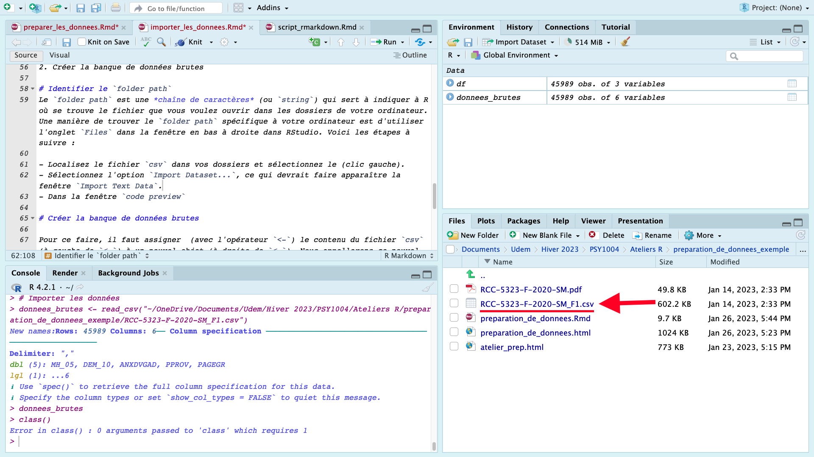
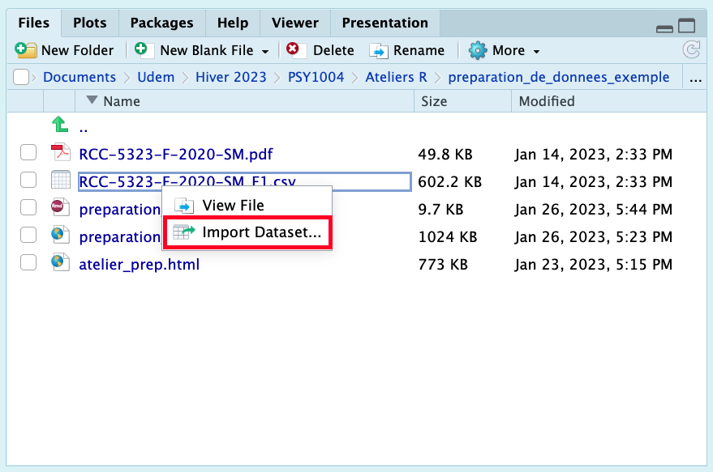
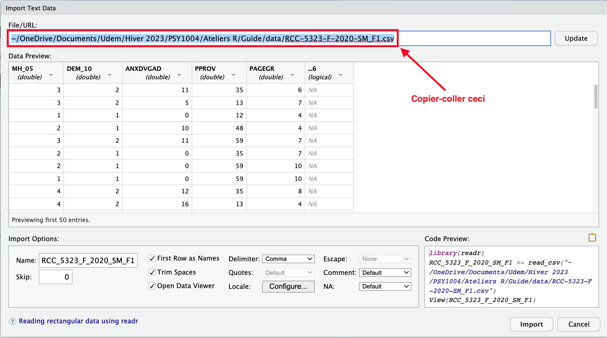

```{r setup, include=FALSE}
# Packages
library(readr)
library(knitr)

# Importer les données
donnees_brutes <- read_csv("../data/RCC-5323-F-2020-SM_F1.csv") 
```

---

***Important :*** Ce guide assume que vous savez comment :  

1. [Rédiger un script RMarkdown](../content/script_rmarkdown.html)  
2. [Installer et activer des packages](../content/packages.html)  

Vous pouvez cliquer sur les liens ci-dessus pour consulter les guides associées.

---

Pour *analyser* des données, il faut tout d'abord *avoir* des données à analyser! Dans ce guide, nous allons apprendre comment importer un fichier de données de type `csv` dans R. 

L'acronyme `csv` signifie *Comma Separated Variables*. Je vous montre comment importer ce format en particulier car c'est un type de fichier très simple qui constitue en quelque sorte le « standard » pour le partage des banques de données en science — c.-à-d. des banques de données où les colonnes représentent des variables et les rangés représentent des observations. Sachez qu'il est possible (et généralement tout aussi facile) d'importer d'autres type de fichier de données dans R (ex.: Excel = `.xlsx`, SPSS = `.sav`).

## Avant d'importer : fichier Odesi

À titre d'exemple, je suis aller chercher une banque de données sur la plateforme Odesi (comme vous aurez à le faire pour votre TP). Le fichier de données (`RCC-5323-F-2020-SM_F1.csv`) ainsi que la documentation Odesi concernant son contenu (`RCC-5323-F-2020-SM.pdf`) sont disponibles sur Studium. Je vous invite à télécharger ces documents pour suivre cette démonstration. Voici comment y accéder :   
`Ateliers R` > `Importer et préparer les données (exemple)` 

# Activer `readr`

Nous aurons besoin d'activer le package `readr` puisqu'il plusieurs fonctions permettant de lire des fichiers de données. Spécifiquement, la fonction qui nous intéresse est `read_csv()`. Comme nous l'avons vue dans le guide `package.htlm`, la syntaxe suivante permet d'activer le package `readr`:
```{r}
library(readr)
```

Une fois le package activé, il vous reste deux choses à faire pour importer votre base de données : 

1. Identifier le `folder path` du fichier `.csv` dans votre ordinateur.

2. Créer la banque de données brutes

# Identifier le `folder path`
Le `folder path` est une *chaîne de caractères* (ou `string`) qui sert à indiquer à R où se trouve le fichier que vous voulez ouvrir dans les dossiers de votre ordinateur. Une manière de trouver le `folder path` spécifique à votre ordinateur est d'utiliser l'onglet `Files` dans la fenêtre en bas à droite dans RStudio. Voici les étapes à suivre : 

- Localiser le fichier `csv` dans vos dossiers et sélectionner le (clic gauche).  
  

- Sélectionner l'option `Import Dataset...`.
  
- Dans la section `File/URL:` de la fenêtre `Import Text Data` qui apparaît, copier-coller le `folder path` (chaîne de caractères entre guillemets `""`)


# Créer la banque de données brutes

Maintenant qu'on a le `folder path`, il est très facile de créer la banque de données brutes. Pour ce faire, il faut **assigner** (avec l'opérateur `<-`) le contenu du fichier `csv` (à gauche de `<-`) à un nouvel objet (à droite de `<-`). Nous appellerons ce nouvel objet `donnees_brutes` par soucis de clarté. Voici la syntaxe (n'oubliez pas de remplacer le `folder path`!) :

```{r, eval=FALSE}
donnees_brutes <- read_csv("folder path") 
```

On peut maintenant afficher l'objet qu'on vient de créer en appellant son nom : 

```{r}
donnees_brutes
```

Si vous obtenez le output ci-dessus, félicitation! Vous êtes prêt.e à passer au guide suivant (`preparation_de_donnees.html`).

---

***À noter pour le TP :***  Dans votre travail pratique, vous n'aurez **pas besoin de présenter et expliquer les étapes nécessaires pour importer vos données**. Le code nécessaire pour importer les données sera simplement inclu au bloc de code `setup` au tout début de votre script `.Rmd`. Ce bloc de code ne s'affiche pas dans le document final à cause de l'argument `include=FALSE` dans les paramètres du bloc. Pour plus de détails, veuillez consulter la section 3.1 du guide [Rédiger un script RMarkdown](../content/script_rmarkdown.html). 